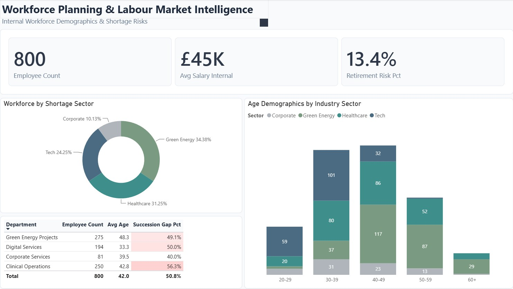
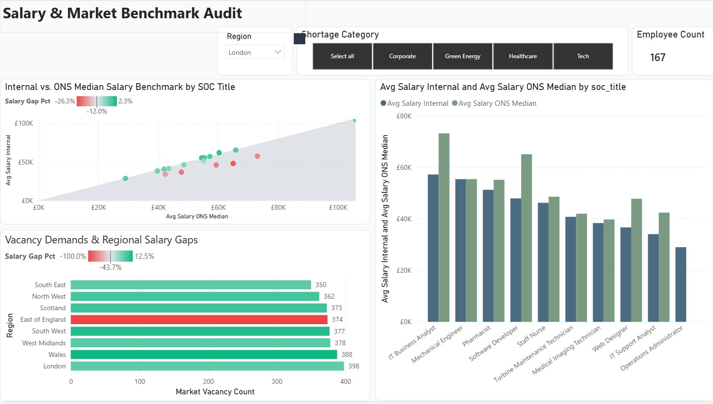
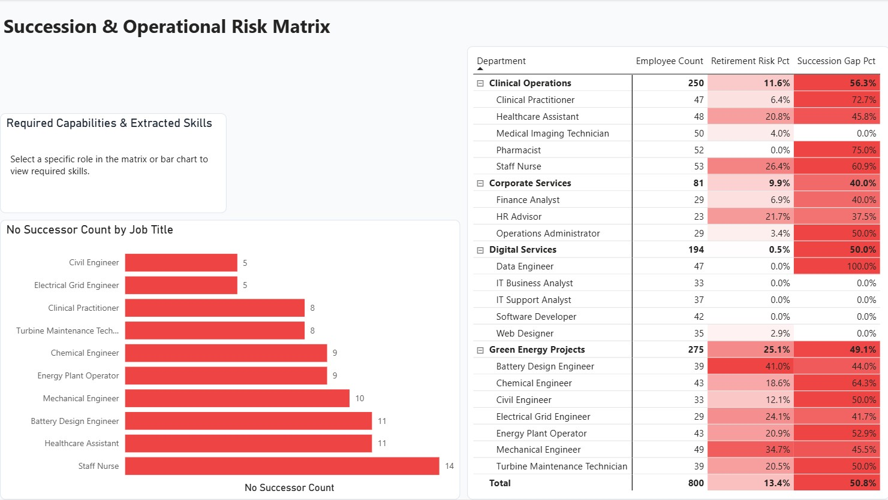

# Workforce Planning & Labour Market Intelligence Platform

[](https://github.com/WarWolf95/Workforce-Planning-Labour-Market-Intelligence/actions/workflows/ci.yml)
[](https://www.python.org/)
[](https://powerbi.microsoft.com/)
[](LICENSE)
[](https://www.sqlite.org/)

An enterprise-grade Python data engineering pipeline, analytical database, and Power BI dashboard designed to model, audit, and benchmark organizational workforce rosters against macroeconomic UK labor supply, ONS ASHE earnings distributions, and live Adzuna market vacancy data.

Designed for Chief People Officers, Workforce Analytics Leads, and Remuneration Committees, this platform quantifies **skills shortages**, **succession/retirement cliffs**, and **internal-to-market salary disparities** across critical UK shortage sectors (Technology, Green Energy, and Healthcare).

---

## Power BI 3-Page Executive Dashboard Showcase

The Power BI report (`powerbi/Workforce Planning & Labour Market Intelligence.pbix`) is designed in an executive **UK Finance Slate Theme** with an integrated Star Schema relational model.

### Page 1: Strategic Workforce Overview & Shortage Index
Provides executive leadership with a consolidated view of headcount distribution, average compensation, age demographic cohorts, and shortage category allocation across departments.



---

### Page 2: Market Salary Gaps & ONS ASHE Benchmark
Enables HR remuneration and compensation committees to detect underpaid roles against regional ONS ASHE median benchmarks. Features an offline regional vacancy audit and a $45^\circ$ reference parity scatter visual mapping internal vs. market rates.



---

### Page 3: Succession Planning & Critical Role Retirement Risk
Evaluates 5-year retirement exposure for staff aged $\ge 55$ alongside succession pipeline readiness. Pinpoints single points of operational failure where senior engineers have no designated successor.



---

## Data Provenance & Methodology

**This project uses a 4-tier hybrid data strategy.** Every dataset is explicitly classified below. No actual employee PII is used or generated.

### Tier 1: Fully Synthetic
| Dataset | Source | Notes |
| :--- | :--- | :--- |
| `internal_workforce.csv` | `generate_synthetic_hr.py` (seed=42) | 800 HR roster records containing employee ages, salaries, skills, and succession flags. |
| `internal_job_descriptions.json` | `generate_synthetic_hr.py` | Template-generated role descriptions. |
| `extracted_jd_skills.csv` | TF-IDF scan on synthetic JDs | Predefined taxonomy keyword mapping (not AI text-mining). |

### Tier 2: Calibrated / Statistically Modelled
| Dataset | Calibrated To | Accuracy Caveat |
| :--- | :--- | :--- |
| `ons_ashe_salaries.csv` | ONS ASHE 2024/2025 published medians by SOC + regional multipliers | Point estimates. Calibrated against published ONS distributions. |
| `ons_vacancies.csv` | ONS VACS02 vacancy volumes by SOC and region | Growth trends applied at category level; regional breakdown uses fixed weights. |
| `ons_labor_supply.csv` | ONS Labour Force Survey employment + graduate pipeline data | Approximate retirement risk rates and graduate supply. |

### Tier 3: Real (Live API)
| Dataset | Source | Status |
| :--- | :--- | :--- |
| `nomis_region_wage_index.json` | Nomis API (`NM_99_1`) | Fetched live at runtime. Falls back to cached values if API is offline. |

### Tier 4: Hybrid (Real API + Mock Fallback)
| Dataset | Source | Status |
| :--- | :--- | :--- |
| `adzuna_vacancies.csv` | Adzuna API (via `ADZUNA_APP_ID` / `ADZUNA_APP_KEY`) | Fetched live if API credentials are provided. Falls back to 3,000 seeded synthetic postings. |

---

## Benchmark KPI Targets & Verification Assertions

Key metric assertions are verified in automated test suites (`tests/test_data_quality.py`, `scripts/verify_db.py`) to guarantee deterministic pipeline integrity:
1. **Software Developer (London)**: Reflects an internal salary lag of exactly **-26.3%** (£47,907 average internal salary vs. £65,040 ONS median benchmark).
2. **Battery Design Engineer**: Reflects a 5-year retirement risk of exactly **41.0%** and **11** critical roles currently operating without a designated successor.

---

## Technical Stack & Architecture

- **Language**: Python 3.10+ (Type annotated, PEP 8 structured, centralized logging)
- **Data Ingestion, ETL & Storage**: Pandas & Polars (utility data handling) and SQLite (staging repository, analytical query engine, and Power BI relational database)
- **Taxonomy Mapping**: Scikit-Learn TF-IDF vectorization (relevance scoring of skills requirements in job descriptions)
- **Visualization**: Power BI Star Schema representation (`.pbix`)
- **Database Migration Utilities**: Oracle DDL/DML setup generator (available for enterprise LiveSQL review)

---

## Directory Structure

```text
Workforce-Planning-Labour-Market-Intelligence/
├── .github/workflows/
│   └── ci.yml                    # Automated GitHub Actions test runner
├── data/
│   ├── raw/                      # Ingested datasets (synthetic HR roster, ONS ASHE, ONS supply, vacancy indexes)
│   └── processed/
│       ├── powerbi/              # Processed Star Schema CSV files for Power BI model ingestion
│       └── workforce_intelligence.sqlite  # Compiled SQLite database (staging + analytical views + Star Schema)
├── powerbi/
│   ├── Dashboard_P1.jpg          # Showcase visual: Strategic Overview
│   ├── Dashboard_P2.jpg          # Showcase visual: Salary Gap Analysis
│   ├── Dashboard_P3.jpg          # Showcase visual: Succession Planning
│   ├── uk_finance_theme.json     # Custom color palette
│   └── Workforce Planning & Labour Market Intelligence.pbix # Completed Power BI report
├── queries/                      # SQL scripts (market demand, salary gaps, skills mismatch, succession risk)
├── reports/                      # Generated CSV reports, Oracle setup, and Executive Briefing
├── scripts/                      # Modular Python processing components
│   ├── config.py                 # Centralized configuration mappings and taxonomies
│   ├── utils.py                  # Shared utilities (casing, TF-IDF taxonomy keyword matcher, logging)
│   ├── generate_synthetic_hr.py  # Produces synthetic corporate HR lists and JDs (fixed seed)
│   ├── fetch_nomis.py            # Acquires ONS ASHE, vacancy, and labor supply datasets
│   ├── fetch_adzuna.py           # Contacts Adzuna API (or falls back to seeded mock job postings)
│   ├── process_data.py           # Ingests raw data to SQLite, builds staging views, and exports Star Schema CSVs
│   ├── generate_oracle_setup.py  # Standalone utility to compile Oracle LiveSQL setup DDL/DML scripts
│   └── verify_db.py              # Executes diagnostic assertions against SQLite analytical views
├── tests/
│   └── test_data_quality.py      # 19 automated unit tests verifying schema integrity and KPI targets
├── LICENSE                       # MIT License
├── requirements.txt              # Standard package requirements
├── run_pipeline.py               # Main pipeline orchestrator script
└── workforce_intelligence.sqbpro # SQLite database project file
```

---

## Getting Started

### 1. Installation
```powershell
# Create virtual environment
python -m venv venv

# Activate virtual environment (Windows PowerShell)
.\venv\Scripts\Activate.ps1

# Install packages
pip install -r requirements.txt pytest
```

### 2. Execute Data Pipeline
Run the orchestrator script to generate synthetic files, retrieve ONS indices, extract skill metrics, compile databases, and export report datasets:
```powershell
python run_pipeline.py
```

Running the pipeline refreshes:
1. Staged database records inside SQLite.
2. The downsampled Oracle SQL insert queries (`reports/oracle_schema_setup.sql`).
3. Power BI modeling CSV files (`data/processed/powerbi/`).
4. Analytical CSV summaries under `reports/`.

### 3. Run Automated Tests
```powershell
python -m pytest tests/ -v
```

### 4. Running SQL Queries
Analytical SQL files are stored in `queries/`. You can execute them directly on the SQLite database or upload the `reports/oracle_schema_setup.sql` script to **Oracle Live SQL** to verify data alignment.

---

## License

This project is licensed under the [MIT License](LICENSE).
