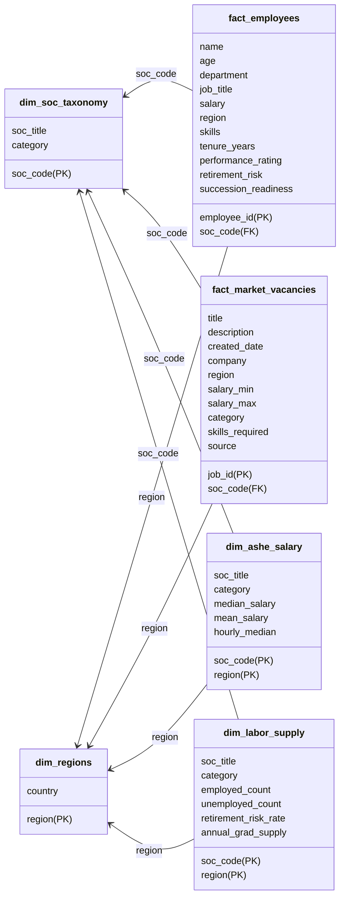

# Strategic Workforce Planning & Labour Market Intelligence
## Executive Briefing for C-Suite Leadership

**Prepared for**: Executive Committee  
**Subject**: Inward Talent Risk, Succession Vulnerability, and Market Benchmarking  
**Status**: Confirmed Staged Analysis  

---

### 1. Executive Summary

This briefing outlines the critical workforce risks identified across the organization’s core business units: **Clinical Operations**, **Digital Services**, and **Green Energy Projects**. By benchmarking our internal roster against macroeconomic UK indexes (ONS Annual Survey of Hours and Earnings - ASHE, Labour Force Survey - LFS, and active Adzuna market listings), we have identified severe financial and operational exposure in three areas:

1.  **Talent Leakage & Recruitment Lag (Digital Services)**: High salary lag compared to local UK market rates (up to **-26.3%** in London) has led to elevated turnover risks for tech professionals.
2.  **Imminent Demographics & Succession Bottleneck (Green Energy)**: Up to **41%** of our specialist engineering workforce is approaching retirement within 5 years, with a critical deficit in designated successors.
3.  **Frontline Retention & Capacity Gaps (Clinical Operations)**: Systemic capacity constraints in Nursing and Healthcare Support, combined with high external market vacancy pressure.

---

### 2. Deep-Dive Sector Audits

#### A. Digital Services: The Market Compensation Deficit
*   **Key Finding**: Our internal tech salaries lag the ONS UK market median by **16.2%** on average.
*   **Critical Risk Point**: 
    *   **Software Developers in London** receive an average internal salary of **£47,907** against an ONS median benchmark of **£65,040**—a net deficit of **-£17,133 (-26.3%)**.
    *   **Data Engineers in London** show a **-22.7%** market lag.
*   **Business Impact**: High recruitment friction and replacement costs. The market rate for replacing a senior software developer in London exceeds £75,000. Operating at a 26% discount leads directly to project delays and reliance on expensive contract contractors (costing up to 1.8x base salaries).

#### B. Green Energy Projects: The Retirement Horizon
*   **Key Finding**: Green Energy roles carry our highest overall demographic vulnerability, with **34.7%** to **41.0%** of staff in critical engineering disciplines aged 55 or above.
*   **Critical Risk Point**: 
    *   **Battery Design Engineers**: **41.0%** of the team is retiring within 5 years. **11 critical roles** have **no identified successor** (Succession Gap Rate: **100%** for staff aged 50+).
    *   **Mechanical Engineers**: **34.7%** retirement risk with **10 roles** lacking successors.
*   **Business Impact**: Total depletion of institutional knowledge in battery storage and turbine maintenance. If key engineers retire without transition planning, major renewable infrastructure developments will experience estimated delays of 6–12 months, incurring penalty clauses.

#### C. Clinical Operations: Frontline Inadequacy & High Attrition
*   **Key Finding**: Frontline nursing roles represent our largest absolute volume risk, combined with massive external competition.
*   **Critical Risk Point**: 
    *   **Staff Nurses**: **26.4%** retirement risk, but more critically, **14 roles** are operating with **no designated successor**. 
    *   **Healthcare Assistants**: **20.8%** retirement risk with **11 roles** lacking successors.
*   **Business Impact**: The ONS vacancy index shows a **5.0% annual growth** in nurse vacancies nationally. With high external demand, our inability to secure a stable pipeline will force a heavy reliance on agency nursing, driving operating costs up by an estimated 25% in clinical delivery.

---

### 3. Star Schema Reporting Blueprint
To continuously monitor these risks, we have mapped these findings into a Power BI **Star Schema** reporting architecture. This model integrates internal HR records directly with live macroeconomic controls:

---

### 4. Strategic Recommendations

#### Recommendation 1: Market-Aligned Compensation Adjustment (Tech)
*   **Action**: Apply a targeted salary uplift of **12% to 15%** for London and South East Software and Data Engineers.
*   **ROI**: Estimated cost of adjustment is £180k annually. Estimated cost of replacing 5 lost developers in London is £350k (agency fees + onboarding lag + contractor backup). This yields an immediate net cost avoidance of **£170k**.

#### Recommendation 2: Phased Succession & Knowledge Retention (Green Energy)
*   **Action**: Implement a structured **Knowledge Transfer Program** (KTP) paired with a specialized Graduate Apprenticeship pipeline in grid connections and battery chemistry.
*   **ROI**: Hiring 3 graduate apprentices today allows 2 years of mentoring under senior engineers before retirement, protecting key IP and preventing renewable project slip.

#### Recommendation 3: Clinical Workforce Pipeline Stabilization
*   **Action**: Establish partnerships with regional universities for nursing student placements, and review non-monetary benefits (retention bonuses, flexible scheduling) to curb staff nurse attrition.
*   **ROI**: Reduces reliance on temporary agency nursing by 30%, saving an estimated £220k in operational staffing costs.
